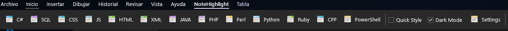
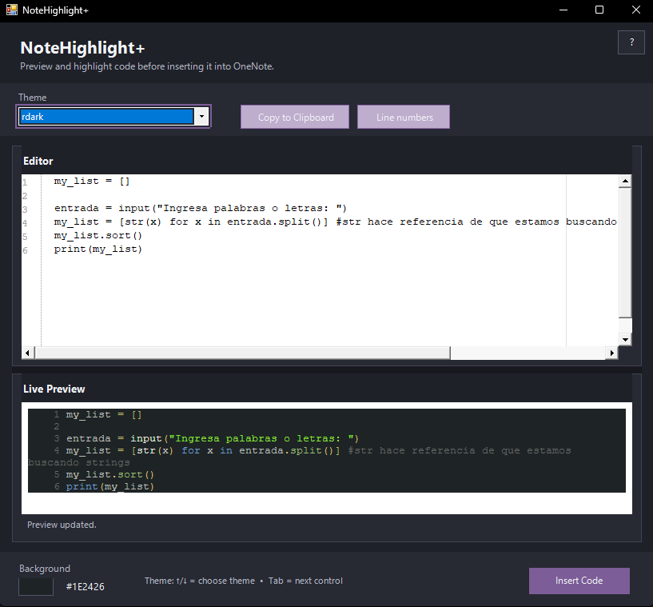
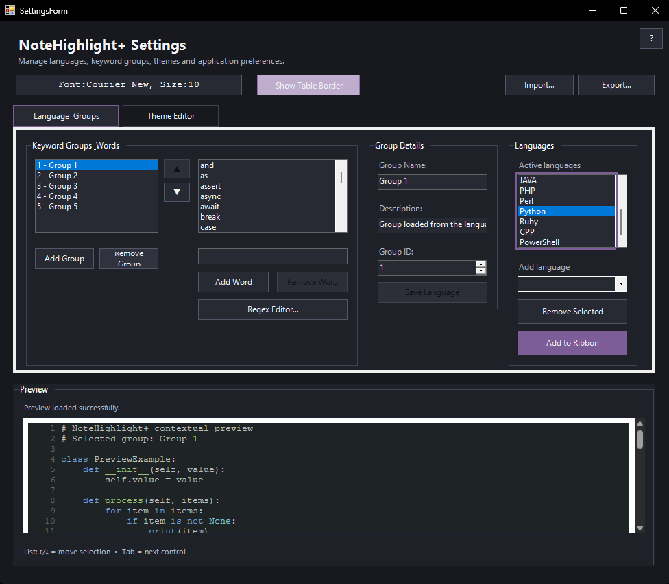
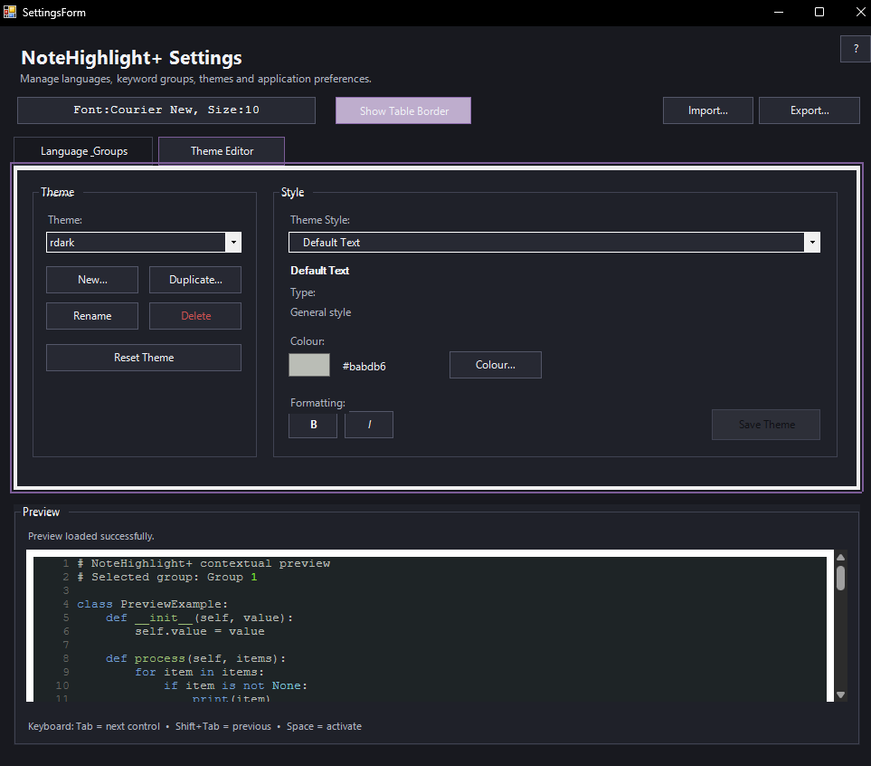
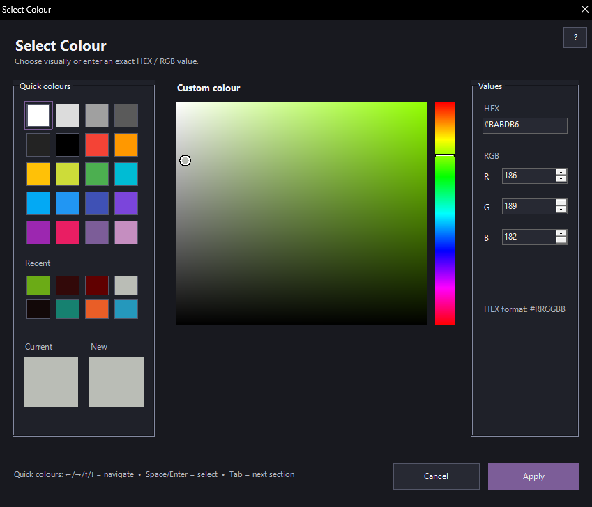
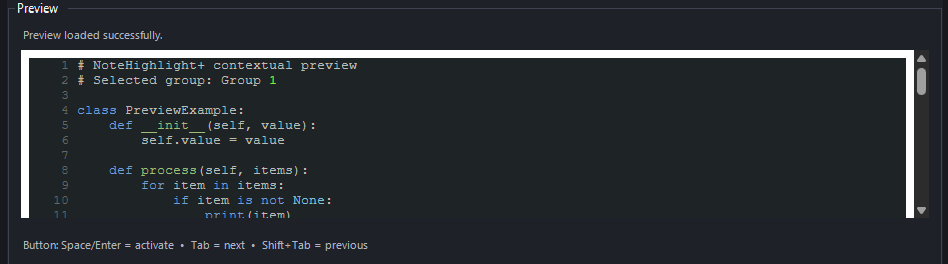
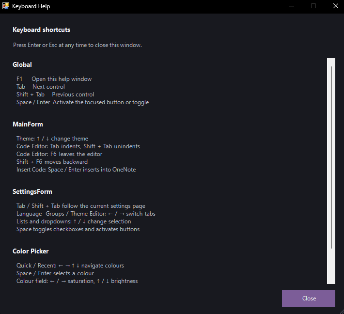
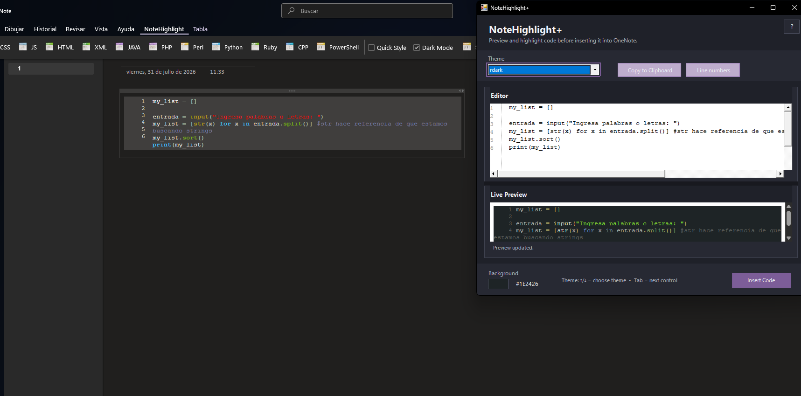

# NoteHighlight+

**Modern syntax highlighting for Microsoft OneNote.**

NoteHighlight+ is a modernized fork of **NoteHighlight2016** that allows you to format source code with syntax highlighting and insert it directly into Microsoft OneNote.

The project expands the original add-in with customizable languages, editable syntax groups, themes, live previews, configuration tools, keyboard accessibility, and a streamlined Windows installer.

> **Latest stable release:** `v4.0.1`



---

## Features

### Syntax Highlighting

Highlight source code directly from OneNote with support for multiple programming languages.



You can:

* Select a programming language from the OneNote Ribbon
* Choose a highlighting theme
* Enable or disable line numbers
* Select a background color
* Preview the result before inserting it
* Copy the highlighted result to the clipboard
* Insert the formatted code directly into OneNote

---

### Language Editor

NoteHighlight+ includes a language configuration editor that allows syntax definitions to be customized without modifying the source code.



You can:

* Add languages
* Remove languages
* Enable or disable languages
* Add languages to the OneNote Ribbon
* Create keyword groups
* Rename groups
* Add descriptions
* Move groups up or down
* Add and remove keywords
* Move existing keywords between groups
* Edit regular expressions
* Prevent duplicate keyword assignments

Language customizations are stored separately from the installed application.

---

### Theme Editor

Themes can be customized directly from the application.



The Theme Editor supports:

* Creating themes
* Duplicating themes
* Renaming themes
* Removing custom themes
* Resetting themes
* Editing syntax colors
* Bold styles
* Italic styles
* Background configuration
* Live preview

Syntax categories include items such as:

* Keywords
* Strings
* Numbers
* Comments
* Operators
* Preprocessor directives
* Interpolation
* Line numbers

---

### Color Picker

NoteHighlight+ includes a custom color picker designed to make theme and background customization easier.



It includes:

* RGB values
* HEX colors
* Quick colors
* Recent colors
* Current and new color comparison
* Full keyboard navigation

---

### Live Preview

Changes to highlighting settings can be previewed before inserting code into OneNote.



The preview system works with:

* Themes
* Language definitions
* Keyword groups
* Font settings
* Line numbers
* Background settings

---

### Import & Export

Language, theme, and configuration data can be exported and imported.

This makes it easier to:

* Back up custom configurations
* Move settings between computers
* Share themes
* Share customized language definitions

---

### Keyboard Accessibility

The main interfaces can be operated using the keyboard.



Keyboard navigation is supported in:

* Main window
* Settings
* Theme Editor
* Color Picker

A built-in keyboard help window is available at any time using **F1**.

The help window can be closed using **Esc** or **Enter**.

---

## Installation

### Recommended Installation

Download the latest installer from the project's **GitHub Releases** page.

For `v4.0.1`, download the provided `.msi` package and run it normally.

The installer handles the required OneNote add-in registration automatically.

You do **not** need to manually run `RegAsm`.

### Requirements

* Windows x64
* Microsoft OneNote desktop
* .NET Framework 4.8

> NoteHighlight+ `v4.0.1` is built and tested as an **x64** application.

After installation, start or restart OneNote. The NoteHighlight+ controls should appear in the OneNote Ribbon.

---

## Basic Usage



1. Open OneNote.
2. Select the source code you want to highlight.
3. Choose a language from the NoteHighlight+ Ribbon controls.
4. Open NoteHighlight+.
5. Select a theme.
6. Configure options such as line numbers or background color.
7. Preview the result.
8. Click **Insert Code**.

The formatted code will be inserted directly into the current OneNote page.

---

## Configuration

NoteHighlight+ separates application files from user-editable configuration.

### Application Files

Installed files are stored under:

```text
C:\Program Files\Arukian\NoteHighlight+\
```

This directory contains the application binaries and bundled resources.

### User Configuration

Editable configuration is stored under:

```text
%LOCALAPPDATA%\Arukian\NoteHighlight+\highlight\
```

This includes:

```text
themes\
langDefs\
filetypes.conf
```

Keeping these files in `LocalAppData` allows NoteHighlight+ to modify themes and language definitions without requiring administrator privileges.

It also allows user customizations to survive normal application upgrades and uninstall/reinstall cycles.

---

## Building from Source

NoteHighlight+ currently targets:

```text
.NET Framework 4.8
Platform: x64
```

For a production build:

1. Open the solution in Visual Studio.
2. Select the **Release** configuration.
3. Select **x64** as the target platform.
4. Build the production projects.
5. Build the `Setup` project to generate the MSI installer.

Test and development projects are not required for the production Release build.

---

## Release Information

### v4.0.1

`v4.0.1` is the current stable release of NoteHighlight+.

The release has been tested with:

* Clean installation
* OneNote add-in registration
* Ribbon loading
* Main highlighting window
* Settings
* Language selection
* Language editing
* Theme Editor
* Theme switching
* Live Preview
* Line numbers
* Code insertion
* OneNote restart
* Uninstallation
* Preservation of user configuration
* Upgrade from `v4.0.0` to `v4.0.1`

---

## Updating NoteHighlight+

New versions can be installed over an existing installation.

User-created themes, language definitions, and other editable configuration stored in `LocalAppData` are designed to remain available after an update.

---

## Project Status

**NoteHighlight+ v4.0.1 is considered feature complete and stable.**

Development is currently focused on maintenance rather than adding features.

Future releases may be created for bug fixes, compatibility improvements, or features that provide a meaningful improvement to the add-in.

---

## Credits

NoteHighlight+ is based on the original **NoteHighlight2016** project by its original developers and contributors.

NoteHighlight2016 itself builds upon earlier work from the **NoteHighlight 2013** project and **VanillaAddin**, and uses **Highlight** as the syntax-highlighting engine.

NoteHighlight+ expands that foundation with a redesigned configuration system, editable language and keyword groups, theme editing, live previews, import/export tools, keyboard accessibility, configuration persistence, a modernized interface, and an updated installation workflow.

Many thanks to the developers and contributors of these projects for providing the foundation that made NoteHighlight+ possible.

### Original Project

**NoteHighlight2016:**
https://github.com/elvirbrk/NoteHighlight2016

---

## License

NoteHighlight+ is distributed according to the licensing terms applicable to the original NoteHighlight2016 project and the modifications made in this fork.

See the repository's license file for complete licensing information.

---

## Contributing

NoteHighlight+ is currently considered feature complete, but bug reports and compatibility reports are welcome.

If you encounter a problem, please include:

* Windows version
* OneNote version
* NoteHighlight+ version
* Programming language selected
* Steps to reproduce the issue
* Any relevant error message or screenshot

---

**NoteHighlight+**
*Syntax highlighting for OneNote, with customization built in.*
